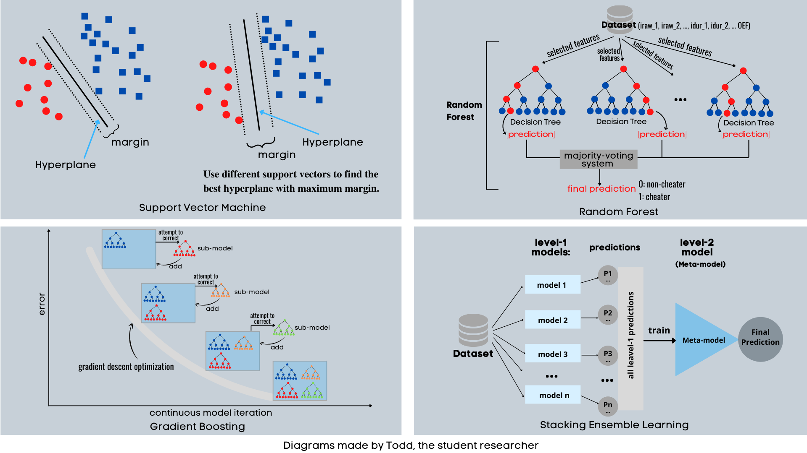
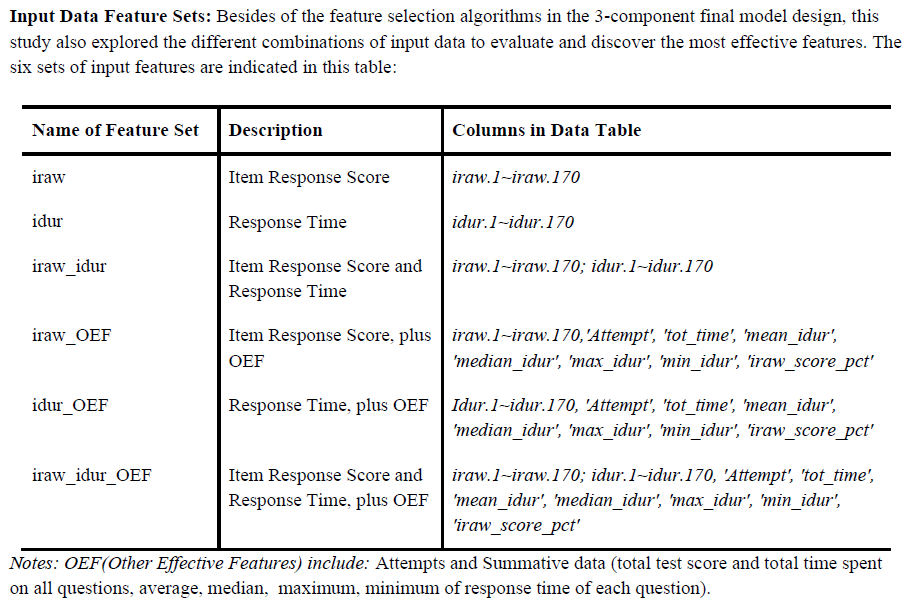

  

  <h2 align="center">Developing an Innovative Meta-Model Using the Stacking Ensemble Machine Learning Algorithm for Cheating Detection in Large-Scale Assessment</h2>

 

## About The Project
Based on Stacking Ensemble Machine Learning structure, I enhanced the stacking learning algorithm to build the meta-model for cheating detection.

  

## 1. machine learning algorithms

  

## 2. initial design of my stacking learning (1-component)

  

## 3. the details of my stacking learning (1-component)

  

## 4. the details of my stacking learning (1-component)

  

## 5. base models explored in this project

Decision Trees (Tripathi 2020, Patel et al 2018), Random Forest (Biau 2012), Support Vector Machine (Chang et al 2007), Logistic Regression (Maalouf 2011); Descriminant Analysis (Tharwat et al 2017); Gradient Boosting (Natekin et al 2013, Biau et al 2019); Naive Bayes (Rish 2001, Kaviani et al 2017); Neural Network in sikit learn library (Choudhury 2020, Pedregosa et al 2011). 

  

## 6. feature sets

  

